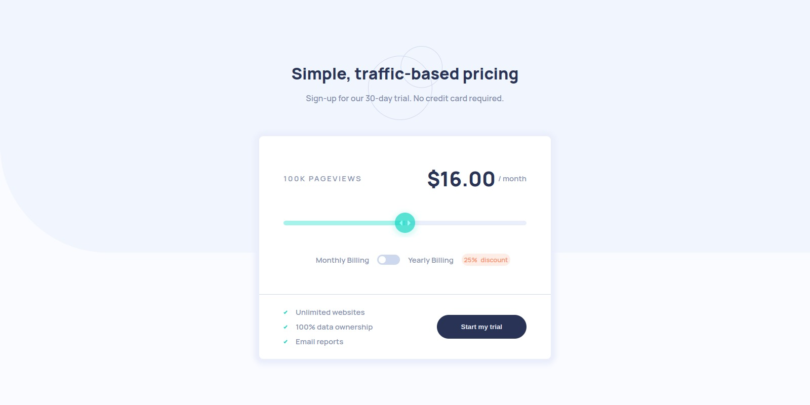

# Frontend Mentor - Interactive pricing component solution

This is a solution to the [Interactive pricing component challenge on Frontend Mentor](https://www.frontendmentor.io/challenges/interactive-pricing-component-t0m8PIyY8). Frontend Mentor challenges help you improve your coding skills by building realistic projects.

## Table of contents

- [Overview](#overview)
  - [The challenge](#the-challenge)
  - [Screenshot](#screenshot)
  - [Links](#links)
- [My process](#my-process)
  - [Built with](#built-with)
  - [Useful resources](#useful-resources)
- [Author](#author)

## Overview

### The challenge

Users should be able to:

- View the optimal layout for the app depending on their device's screen size
- See hover states for all interactive elements on the page
- Use the slider and toggle to see prices for different page view numbers

### Screenshot

### Links

- Solution URL: [Interactive price component](https://github.com/tabascum/interactive-pricing-component)
- Live Site URL: [Interactive price component](https://tabascum-interactive-pricing-comp.netlify.app)

## My process

### Built with

- Semantic HTML5 markup
- CSS custom properties
- Flexbox
- Mobile-first workflow
- Sass

### Useful resources

- [How to - Range Sliders ](https://www.w3schools.com/howto/howto_js_rangeslider.asp) - This helped figure out how to style a slider and to display the range value.
- [Interactive Pricing Component](https://codepen.io/iamsofiullah/pen/yLbmMow) - Thanks to Sofiullah Chowdhury approach to this challenge, I could pick the input value and link it to the provided values.

## Author

- Frontend Mentor - [@tabascum](https://www.frontendmentor.io/profile/tabascum)
